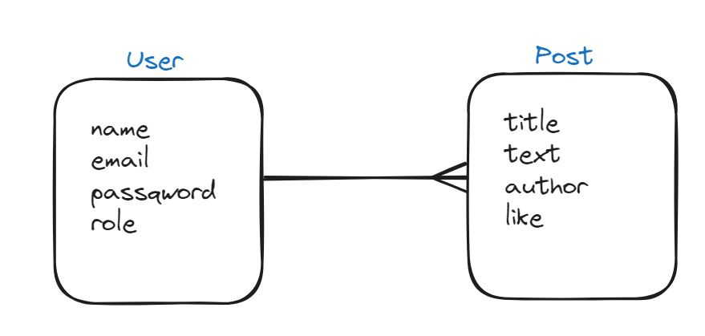

# 🔹 Social Network api 🔹 <!-- revisar, no está acabado -->

  
Welcome to the Social Network's api documentation. This api recreates a fictional database where users can register, log post and like post.

<details>
  <summary>Table of content 📂</summary> <!-- modificar -->
  <ol>
    <li><a href="## Deploy 🚀 ">Deploy 🚀 </a></li>
    <li><a href="## Stack ⚓">Stack ⚓</a></li>
    <li><a href="## Diagram Database 🌐">Diagram Database 🌐</a></li>
    <li><a href="## Local installation 💻">Local installation 💻</a></li>
    <li><a href="## Users created 👓">Users created 👓</a></li>
    <li><a href="## Endpoints ✨">Endpoints ✨</a></li>
    <li><a href="## Author ✒️">Author ✒️</a></li>
    <li><a href="## Acknowledgements 🙏">Acknowledgements 🙏</a></li>
  </ol>
</details>

## Deploy 🚀

<div align="center">
    <a href="https://social-network-backend-dev-npdx.2.ie-1.fl0.io"><strong>~ URL to deploy ~ </strong></a>
</div>

## Stack ⚓

Tecnologies used:

  


  


## Diagram Database 🌐



## Local installation 💻

1. Clon repository  
   `$ npm init --yes`
2. Instal express  
   `$ npm i express`
3. Instal nodemon  
   `$ npm i nodemon -D`
   ` $ npm i dotenv -E`
4. Add type module into package.json

```json
{
  "type": "module"
}
```

5. Instal mongoose  
   `$ npm i mongoose`
6. Instal bcrypt  
   `$ npm i bcrypt`
7. Instal webtoken  
   `$ npm i jsonwebtoken`

## Users created 👓
1. User - role: user
```json
{
  "name": "user",
  "email": "user@user.com",
  "password": "123456"
}
```

2. Admin - role: admin
```json
{
  "name": "admin",
  "email": "admin@admin.com",
  "password": "123456"
}
```

3. Superadmin - role: superadmin
```json
{
  "name": "superadmin",
  "email": "superadmin@superadmin.com",
  "password": "123456"
}
```

## Endpoints ✨

<details>
  <summary>Auth</summary> 
  <details>
  <summary>User Registration</summary>  
  -  Register new user
    
    Registers a new user.

        POST https://social-network-backend-dev-npdx.2.ie-1.fl0.io/api/auth/register

    Body:

```json
{
  "name": "user",
  "email": "user@user.com",
  "password": "123456"
}
```

  </details>

  <details>
<summary>User Login</summary>

- Login user

  User logging using their email and password.
  POST https://social-network-backend-dev-npdx.2.ie-1.fl0.io/api/auth/login

  Body:

```json
{
  "email": "superadmin@superadmin.com",
  "password": "123456"
}
```

</details>
</details>

<details>
<summary>User</summary> 
<details>
<summary>Get Users</summary>  

- Retrieve all users

  Superadmin can retrieve all users registred.
  GET https://social-network-backend-dev-npdx.2.ie-1.fl0.io/api/users

  Auth:
  superadmin's token

    superadmin's credentials:

```json
{
  "email": "superadmin@superadmin.com",
  "password": "123456"
}
```
</details>

<details>

<summary>Get User's Profile</summary>  

- Retrieve user's profile

  User can retrieve their profile.
  GET https://social-network-backend-dev-npdx.2.ie-1.fl0.io/api/users/profile

  Auth:
  user's token

    user's credentials:

```json
{
  "email": "user@user.com",
  "password": "123456"
}
```
</details>

<details>
<summary>Update User's Profile</summary>  

- Update user's profile

  User can update their name.
  PUT https://social-network-backend-dev-npdx.2.ie-1.fl0.io/api/users/profile/

  Auth:
  user's token

    user's credentials:

```json
{
  "email": "user@user.com",
  "password": "123456"
}
```   

  Body:

```json
{
  "name": "newname",
}
```   
</details>

<details>
<summary>Delete User</summary>  

- Delete user by id

  Superadmin can delete user using their id.
  DELETE https://social-network-backend-dev-npdx.2.ie-1.fl0.io/api/users/:_id

  Auth:
  superadmin's token

    superadmin's credentials:

```json
{
  "email": "superadmin@superadmin.com",
  "password": "123456"
}
```
</details>

<details>
<summary>Get post by User's id</summary>  

- Retrieve posts by user's id

  User can retrieve posts from other users by their id.
  GET https://social-network-backend-dev-npdx.2.ie-1.fl0.io/api/users/posts/:userId

  Auth:
  user's token

    user's credentials:

```json
{
  "email": "user@user.com",
  "password": "123456"
}
```   
</details>
</details>

<details>
<summary>Post</summary>
<details>
<summary>Create Post</summary>  

- Create new post

  User can create new post.
  POST https://social-network-backend-dev-npdx.2.ie-1.fl0.io/api/posts

  Auth:
  user's token

    user's credentials:

```json
{
  "email": "user@user.com",
  "password": "123456"
}
```   

Body:
```json
{
  "title": "Post's title",
  "text": "Post's text"
}
```   
</details>

<details>
<summary>Update Post</summary>  

- Update a post

  User can update a post using post's id
  PUT https://social-network-backend-dev-npdx.2.ie-1.fl0.io/api/posts/:_id

  Auth:
  user's token

    user's credentials:

```json
{
  "email": "user@user.com",
  "password": "123456"
}
```   

Body:
```json
{
  "title": "Post's title updated",
  "text": "Post's text updated"
}
```   
</details>

<details>
<summary>Delete Post</summary>  

- Delete a post by id

  User can delete a post with post's id
  DELETE https://social-network-backend-dev-npdx.2.ie-1.fl0.io/api/posts/:_id

  Auth:
  user's token

    user's credentials:

```json
{
  "email": "user@user.com",
  "password": "123456"
}
```   
  
</details>

<details>
<summary>Get Posts</summary>  

- Get all posts

  User can get all posts created
  GET https://social-network-backend-dev-npdx.2.ie-1.fl0.io/api/posts/

  Auth:
  user's token

    user's credentials:

```json
{
  "email": "user@user.com",
  "password": "123456"
}
```   
  
</details>


<details>
<summary>Get Post by id</summary>  

- Get post by post's id

  User can get an specific post by post's id
  GET https://social-network-backend-dev-npdx.2.ie-1.fl0.io/api/posts/:_id

  Auth:
  user's token

    user's credentials:

```json
{
  "email": "user@user.com",
  "password": "123456"
}
```   
  
</details>

<details>
<summary>Get Own Posts</summary>  

- Get post own user's post

  User can get their own posts
  GET https://social-network-backend-dev-npdx.2.ie-1.fl0.io/api/posts/own

  Auth:
  user's token

    user's credentials:

```json
{
  "email": "user@user.com",
  "password": "123456"
}
```   
  
</details>

<details>
<summary>Like/Unlike post</summary>  

- Put/Pull Like on post

  User can like or unlike a post using post's id
  GET https://social-network-backend-dev-npdx.2.ie-1.fl0.io/api/posts/like/:_id

  Auth:
  user's token

    user's credentials:

```json
{
  "email": "user@user.com",
  "password": "123456"
}
```   

</details>
</details>

## Author ✒️

- Ana Rius - student FSD
  - [GitHub](https://github.com/ariusvi)

## Acknowledgements 🙏

Special thanks to Daniel Tarazona for his incredible work as a teacher and above all for his infinite patience in helping to resolve any doubts and calm the panic.

Thanks to my classmates:  
Pedro for his patience and help, especially to confirm that I understand things.  
Marina and Marta for her moral support, with laughter and tears, as well as their help.
